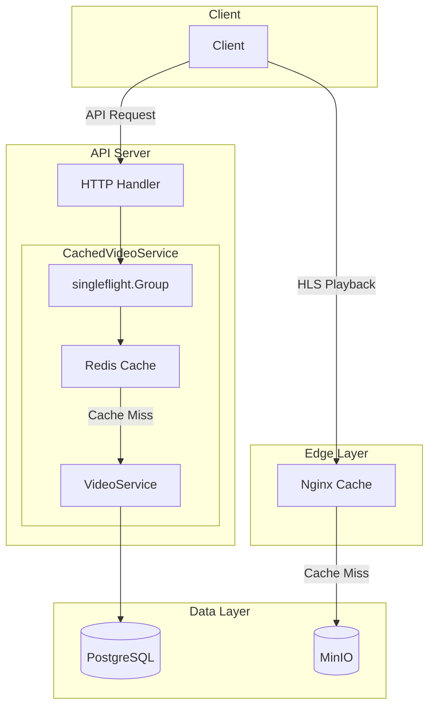
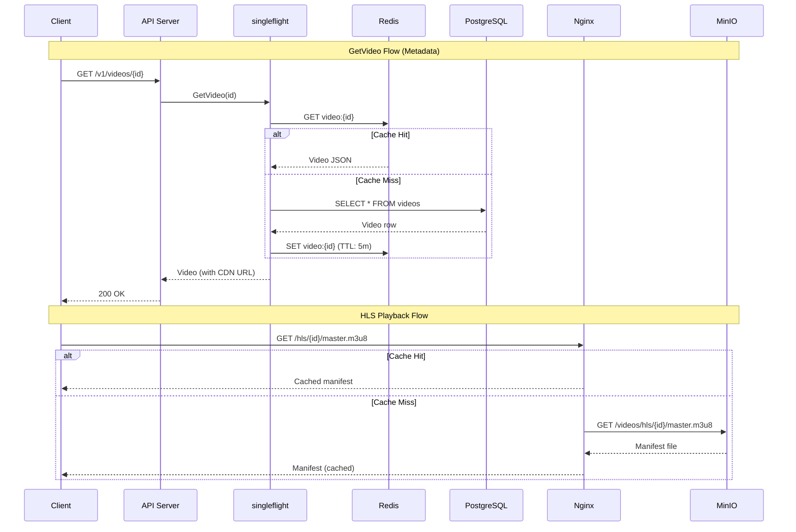
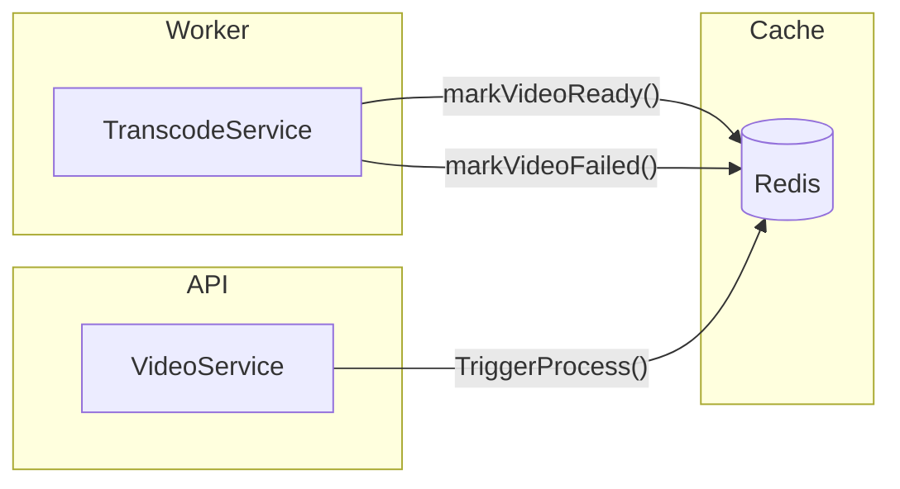

# Caching & CDN Integration Design

## Overview

Implement multi-layer caching and CDN integration for GoStream to reduce direct access to PostgreSQL and MinIO, improving scalability and response times.

## Architecture



### Request Flow



### Cache Invalidation Flow



## Key Design Decisions

### 1. Cache Layer: Decorator Pattern at Service Layer

**Decision**: Wrap `VideoService` with `CachedVideoService`

**Rationale**:
- **Open/Closed Principle**: Extend without modifying existing code
- **Testability**: Cache logic can be tested independently
- **Clear separation of concerns**: Business logic vs caching logic

### 2. Nginx as CDN Proxy

**Decision**: Nginx caches requests to MinIO for HLS content

**Rationale**:
- `/hls` is already publicly accessible (`mc anonymous set download` configured)
- HLS segments (`.ts`) are immutable → long-term caching possible
- Manifests (`.m3u8`) may be updated → shorter cache TTL

**Cache TTL**:
| Content Type | TTL | Reason |
|--------------|-----|--------|
| `.ts` segments | 7 days | Immutable content |
| `.m3u8` manifests | 1 hour | May be updated for bug fixes or re-encoding |

### 3. URL Generation Strategy

**Decision**: Return CDN URLs for `Status == READY` videos

**Implementation**:
- Storage path: `hls/{videoID}/master.m3u8`
- CDN URL: `http://localhost:8081/hls/{videoID}/master.m3u8`

**Rationale**:
- HLS content is public, no presigned URLs needed
- CDN URLs are more browser-cache friendly
- Simpler client implementation

### 4. Cache Invalidation: Hybrid Approach

**Decision**: TTL-based with event-driven supplement

**Triggers**:
| Event | Action |
|-------|--------|
| `TriggerProcess()` | DEL video:{id} |
| `markVideoReady()` | DEL video:{id} |
| `markVideoFailed()` | DEL video:{id} |
| TTL expiration | Auto-expire (5 min) |

**Rationale**:
- Event-driven ensures immediate consistency on status changes
- TTL provides safety net against missed invalidation events

---

## Implementation Plan

### PR #1: Infrastructure + Configuration

#### Scope
- Add Redis and Nginx services to docker-compose
- Add configuration structs for Redis and CDN
- Create Nginx configuration file

#### Files to Modify
- `docker-compose.yml`
- `internal/config/config.go`

#### Files to Create
- `configs/nginx/nginx.conf`

#### Configuration Additions

```go
type RedisConfig struct {
    Host     string        `envconfig:"REDIS_HOST" default:"localhost"`
    Port     int           `envconfig:"REDIS_PORT" default:"6379"`
    Password string        `envconfig:"REDIS_PASSWORD" default:""`
    DB       int           `envconfig:"REDIS_DB" default:"0"`
    TTL      time.Duration `envconfig:"REDIS_TTL" default:"5m"`
}

type CDNConfig struct {
    BaseURL string `envconfig:"CDN_BASE_URL" default:"http://localhost:8081"`
}
```

---

### PR #2: Cache Implementation + Integration

#### Scope
- Implement VideoCache interface and Redis implementation
- Implement CachedVideoService decorator
- Add cache invalidation to TranscodeService
- Wire up dependencies in main.go

#### Files to Modify
- `internal/usecase/transcode_service.go`
- `cmd/api/main.go`
- `cmd/worker/main.go`

#### Files to Create
- `internal/infrastructure/cache/video_cache.go`
- `internal/infrastructure/cache/redis.go`
- `internal/infrastructure/cache/redis_test.go`
- `internal/usecase/cached_video_service.go`
- `internal/usecase/cached_video_service_test.go`

#### Interface Design

```go
type VideoCache interface {
    Get(ctx context.Context, videoID uuid.UUID) (*model.Video, error)
    Set(ctx context.Context, video *model.Video, ttl time.Duration) error
    Delete(ctx context.Context, videoID uuid.UUID) error
}
```

---

## Dependencies

```
github.com/redis/go-redis/v9
golang.org/x/sync (singleflight - already available)
```

---

## Testing Strategy

### Unit Tests
| Component | Test Cases |
|-----------|------------|
| RedisVideoCache | Get/Set/Delete operations, error handling |
| CachedVideoService | Cache hit/miss paths, singleflight behavior, CDN URL enrichment |

### Integration Tests
- Full flow: Create → Process → READY → GetVideo (verify CDN URL)
- Nginx caching: Verify `X-Cache-Status: HIT` header

### Manual Testing Checklist
- [ ] HLS playback via CDN URL in VLC
- [ ] Redis cache key inspection via `redis-cli`
- [ ] Nginx cache headers via `curl -I`

---

## Risk Mitigation

| Risk | Likelihood | Impact | Mitigation |
|------|------------|--------|------------|
| Redis connection failure | Low | Medium | Fallback to DB on cache failure (graceful degradation) |
| Stale cache after status change | Low | High | Event-driven invalidation + TTL safety net |
| Thundering herd on cold cache | Medium | Medium | singleflight protection |
| Nginx serving stale manifests | Low | Medium | 1-hour TTL for `.m3u8` files |
